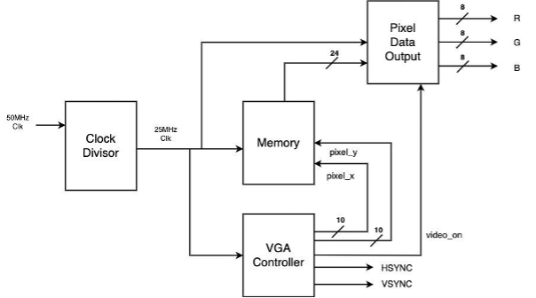
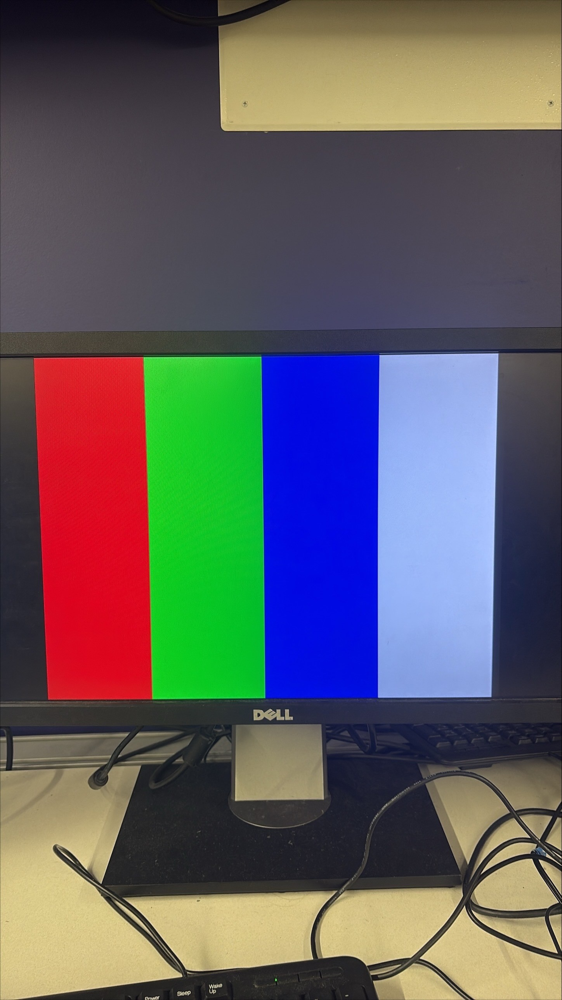
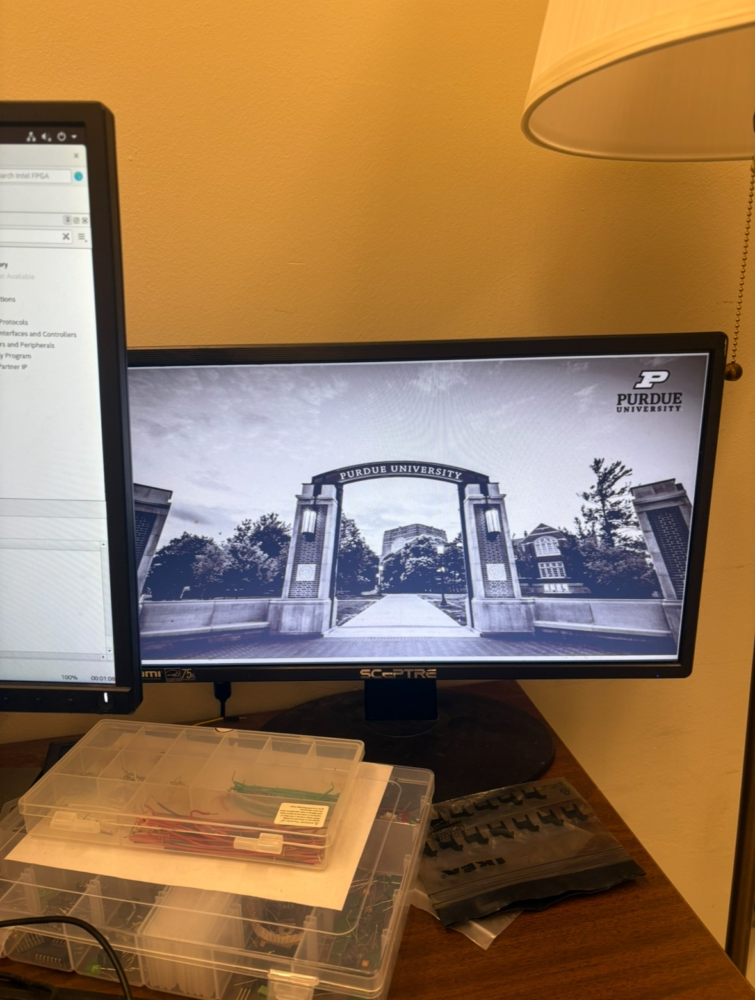

# A guide to the project files for the VGA Output System
This project focuses on enabling VGA image output using the AFTx07 development board. The goal is to render graphics in real time using a SystemVerilog-based VGA controller and test it on the DE2-115 FPGA.

Two primary experiments were conducted:
- A "Four Color Monitor" project that displays four colored boxes
- A "Grayscale Image Output" project that loads and renders an image from internal memory

## Background:
To fully understand this project, familiarity with the following is helpful:
- VGA protocol: HSYNC/VSYNC, RGB signaling, timing
- FPGA-based RTL design: System Verilog, module hierarchy, and signal timing
- Digital video concepts: Framebuffers
- Memory-mapped pixel storage: Using internal ROM to hold pixel values

## System Architecture:
- Input: Clock (e.g., 25 MHz), reset
- Memory: Internal ROM or preloaded RAM for image storage
- VGA Controller: Generates sync signals and RGB output
- Output: VGA port to monitor (DE2-115 pin assignments)

The VGA controller generates horizontal and vertical sync pulses along with RGB output to display either color blocks or grayscale image data stored in internal memory.



## Implementation Details:

### VGA Controller Logic
- Pixel clock: 25 MHz for 640x480
- Horizontal timing: sync pulse, back porch, visible area, front porch
- Vertical timing: similar structure
- RGB data output is synchronized with visible region

### Four Color Monitor
- Divides screen into four quadrants
- Outputs red, green, blue, and white based on (x, y) position

```c
if (horizontal_num < 160) begin
    red = 8'hFF; green = 8'h00; blue = 8'h00; // Red
end else if (horizontal_num < 320) begin
    red = 8'h00; green = 8'hFF; blue = 8'h00; // Green
end else if (horizontal_num < 480) begin
    red = 8'h00; green = 8'h00; blue = 8'hFF; // Blue
end else begin
    red = 8'hFF; green = 8'hFF; blue = 8'hFF; // White
end
```

### Grayscale Image Output
- Image stored in ROM initialized with pixel brightness
- x, y coordinate used to index into ROM
- Output grayscale value on all RGB channels

## How to Test
### Hardware Setup
- FPGA: DE2-115 (Cyclone IV)
- Output: VGA monitor
- Clock: 50 MHz
- Tools: Quartus Prime

## Pin Assignments


## Files for this project:
#### VGA-Project/
- DE2-115 Pin Assignments.csv - pin assignment sheet

#### VGA-Project/Four Color Monitor/
- top.sv - top level RTL code for Four Color Monitor Output project
- Expected output of this code: 



#### VGA-Project/Grayscale Image (Internal Memory)/
- top.sv - top level code for Grayscale Image Output project
- Expected output of this code: 



## Acknowledgements & References:
- https://www.youtube.com/watch?v=Ea_KIhRqLkQ&t=390s - Explanation for basic concept of VGA
- https://github.com/johnwinans/Verilog-Examples/blob/main/vga/sync/vgasync.v - utilized VGA controller from this open source
